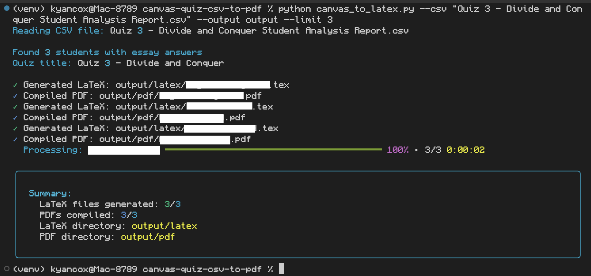
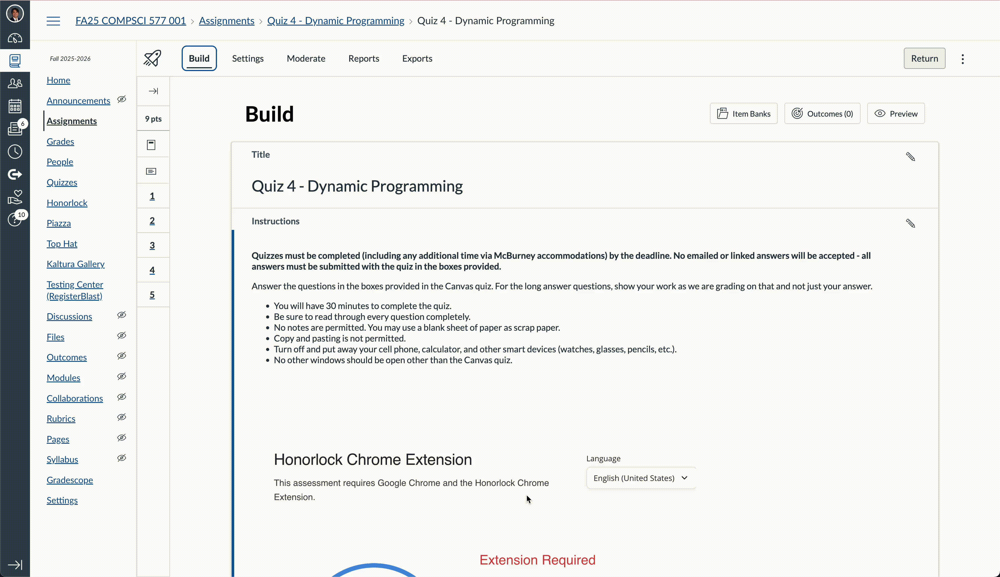

# Canvas Quiz CSV to PDF



A Python tool that converts Canvas quiz exports (CSV format) into individual LaTeX and PDF files for each student, containing only the questions they answered (built for CS 577: Introduction to Algorithms @ UW-Madison).

## Requirements

- Python 3.7+
- LaTeX distribution (TeX Live, MiKTeX, or MacTeX)
- `pdflatex` command-line tool

## Installation

1. Clone this repository:
```bash
git clone https://github.com/kyancox/Canvas-Quiz-CSV-to-PDF
cd canvas-quiz-csv-to-pdf
```

2. Create and activate a virtual environment:
```bash
python3 -m venv venv
source venv/bin/activate  # On Windows: venv\Scripts\activate
```

3. Install Python dependencies:
```bash
pip install -r requirements.txt
```

4. Ensure LaTeX is installed:
   - **macOS**: `brew install mactex` or download from [MacTeX](https://www.tug.org/mactex/)
   - **Ubuntu/Debian**: `sudo apt-get install texlive-latex-base texlive-latex-extra`
   - **Windows**: Download from [MiKTeX](https://miktex.org/)

## Usage

### Basic Usage

```bash
python canvas_to_latex.py --csv "path/to/quiz_export.csv"
```

This will:
1. Parse the CSV file
2. Generate LaTeX files in `output/latex/`
3. Compile PDFs in `output/pdf/`

### CSV Export Tutorial



To export the quiz data from Canvas, navigate to your quiz, then:
- Build the quiz
- Click the "Reports" tab
- Under "Student Analysis", click "Generate"
- Then, click "Export CSV" to download the file
- Place the csv file in this directory

### Advanced Options

```bash
python canvas_to_latex.py --csv "Quiz 3 - Student Analysis Report.csv" \
                          --output "./output" \
                          --template "template.tex" \
                          --limit 5
```

**Arguments:**
- `--csv`: **(Required)** Path to Canvas quiz export CSV file
- `--output`: Output directory for generated files (default: `./output`)
- `--template`: Path to LaTeX template file (default: `template.tex`)
- `--limit`: Limit number of students to process (useful for testing)
- `--no-pdf`: Skip PDF compilation, only generate `.tex` files

### Example

```bash
# Process a quiz export
python canvas_to_latex.py --csv "Quiz 3 - Divide and Conquer Student Analysis Report.csv"

# Test with first 3 students only
python canvas_to_latex.py --csv "quiz_export.csv" --limit 3

# Generate LaTeX files only (no PDF compilation)
python canvas_to_latex.py --csv "quiz_export.csv" --no-pdf
```

## Output Structure

```
output/
├── latex/
│   ├── Student Name 1.tex
│   ├── Student Name 2.tex
│   └── ...
└── pdf/
    ├── Student Name 1.pdf
    ├── Student Name 2.pdf
    └── ...
```

Each PDF contains:
- Quiz title (extracted from CSV filename)
- Student name and ID
- All essay questions the student answered
- The student's answers with proper formatting

## CSV File Format

The tool expects Canvas quiz export CSV files with the following structure:
- Student information columns (`Name`, `ID`)
- Question blocks with columns: `ItemID`, `ItemType`, question text, `EarnedPoints`, `Status`
- Only processes essay questions that are marked as "Graded"

## Template Customization

The LaTeX template (`template.tex`) uses placeholders that are replaced during generation:
- `QUIZTITLE` - Quiz title from CSV filename
- `STUDENTNAME` - Student's name
- `STUDENTID` - Student's ID
- `QUESTIONSSECTION` - Generated questions and answers

You can customize the template to change:
- Document formatting
- Font sizes
- Margins
- Header/footer styles

## Features & Processing

### HTML to LaTeX Conversion
The tool automatically handles:
- Mathematical equations (inline and display)
- Text formatting (bold, italic, subscript, superscript)
- Code/algorithm formatting
- Special LaTeX characters escaping
- Canvas equation images conversion

### Question Types
Currently supports:
- Essay questions with graded responses
- Questions with HTML formatting
- Questions with mathematical notation
- Algorithm/code-style questions

## Troubleshooting

### PDF compilation fails
- Ensure `pdflatex` is installed and accessible from command line
- Check LaTeX log files in the `output/latex/` directory
- Use `--no-pdf` flag to debug LaTeX syntax issues

### No students found
- Verify the CSV file contains essay questions
- Ensure questions are marked as "Graded" in Canvas
- Check that students have submitted answers

### Encoding issues
- Ensure CSV file is UTF-8 encoded
- Check for special characters in student names or questions

## Author

Kyan Cox

